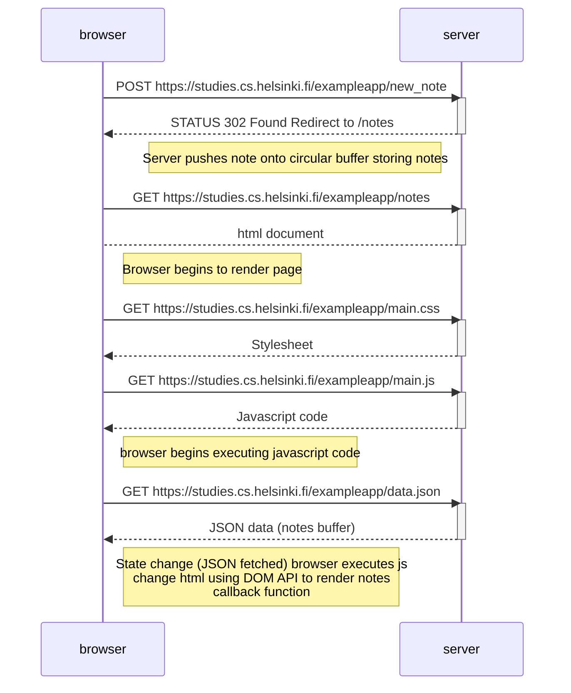

```mermaid
sequenceDiagram
participant browser
participant server

browser->>server: POST https://studies.cs.helsinki.fi/exampleapp/new_note
activate server
server-->>browser: STATUS 302 Found Redirect to /notes
deactivate server

Note left of server: Server pushes note onto circular buffer storing notes

browser->>server: GET https://studies.cs.helsinki.fi/exampleapp/notes
activate server
server-->browser: html document
deactivate server

Note right of browser: Browser begins to render page

browser->>server: GET https://studies.cs.helsinki.fi/exampleapp/main.css
activate server
server-->>browser: Stylesheet
deactivate server

browser->>server: GET https://studies.cs.helsinki.fi/exampleapp/main.js
activate server
server-->>browser: Javascript code
deactivate server

Note right of browser: browser begins executing javascript code

browser->>server: GET https://studies.cs.helsinki.fi/exampleapp/data.json
activate server
server-->>browser: JSON data (notes buffer)
deactivate server

Note right of browser: State change (JSON fetched) browser executes js <br> change html using DOM API to render notes <br> callback function

```
